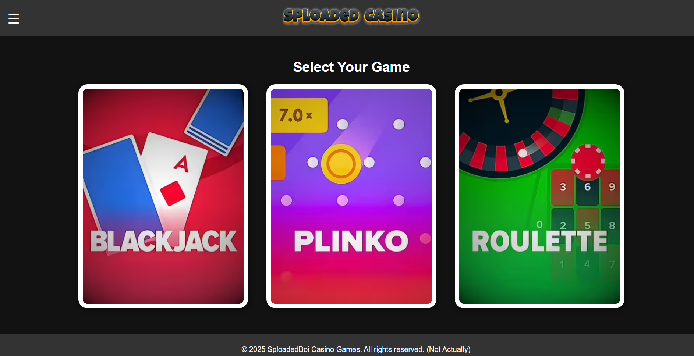
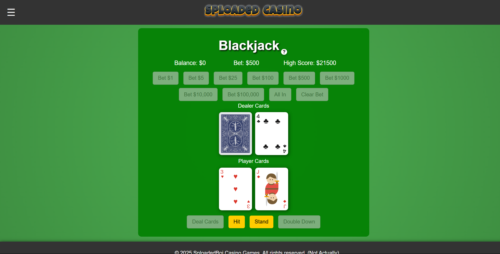
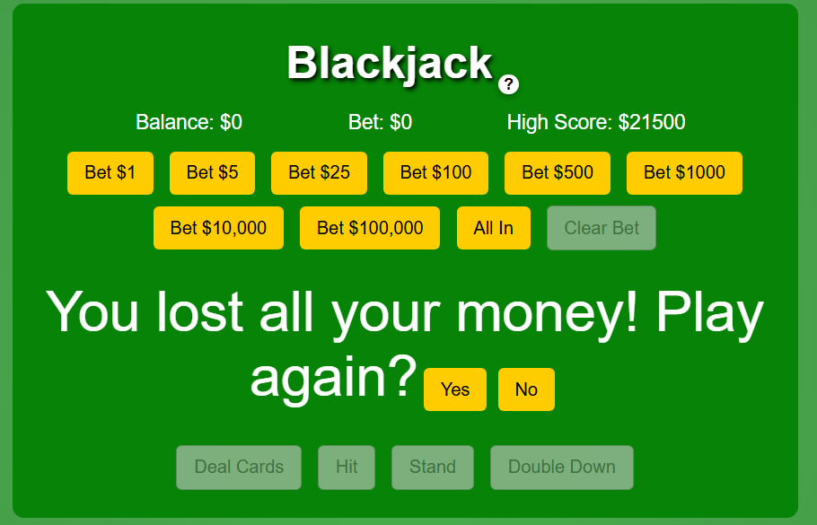
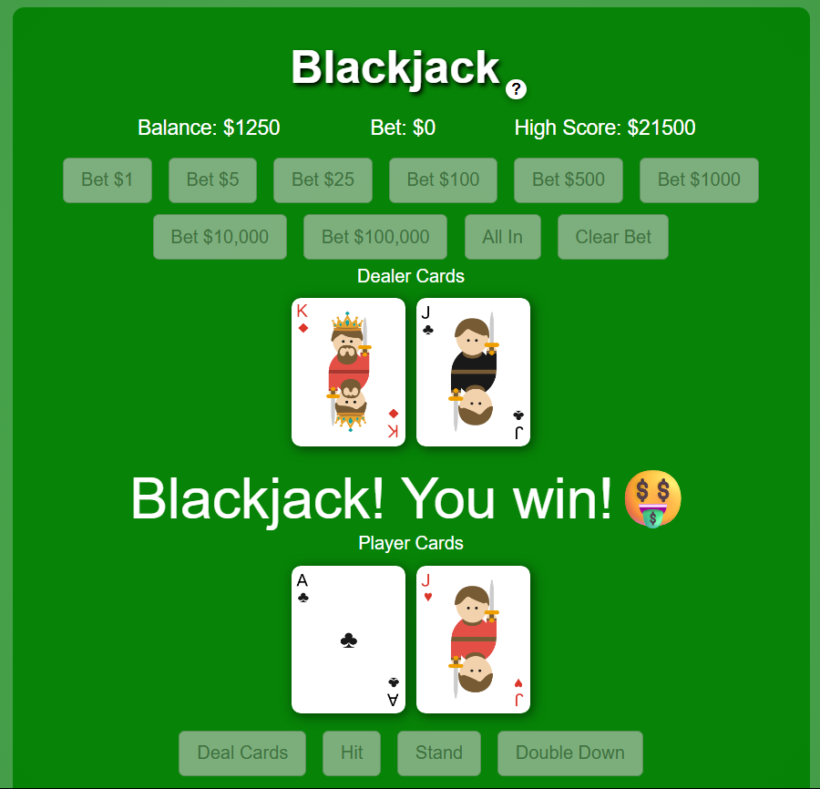
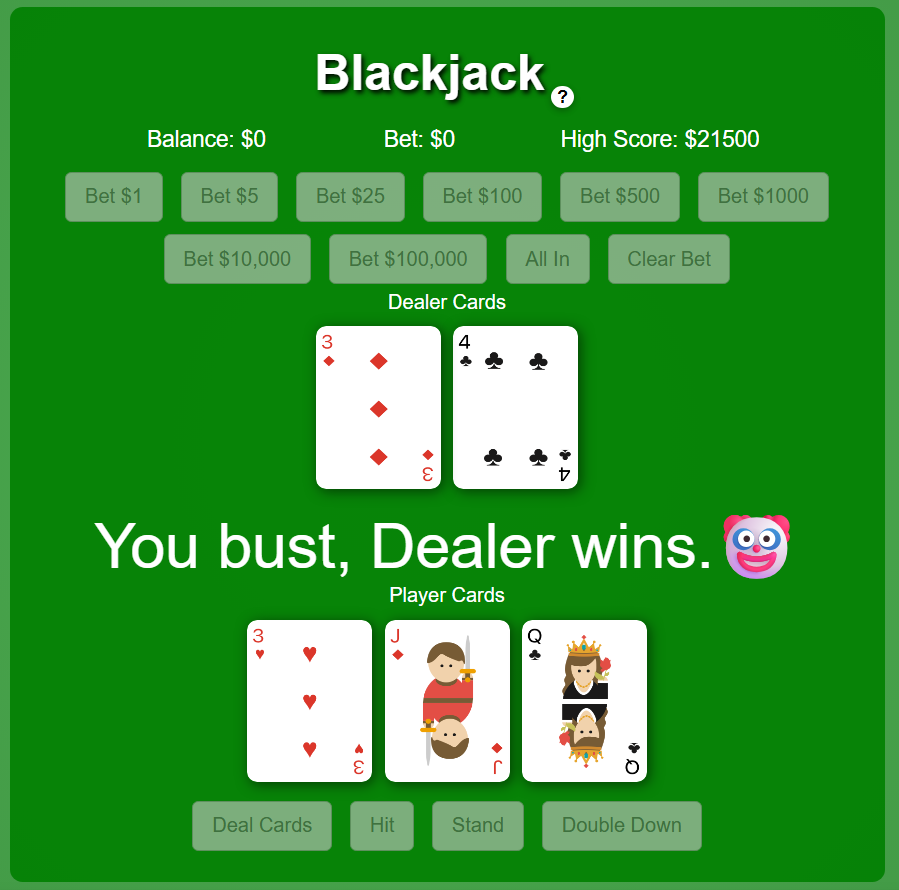

# Sploaded Casino Website

This project is a casino website built with JavaScript, HTML, and CSS, designed to create a fun and interactive gaming experience right in your browser

## Features

- Blackjack – Fully working and ready to play!
- Plinko & Roulette – Still in the works. They're on the roadmap but not quite there yet.

## Screenshots
</image> </image>
<details>
  <summary>View more</summary>
  <br>
    <p align="left">
    </image>
    </image>
    </image>
    </p>
</details>

## Live Demo

Access the live version at: [Sploaded Casino](https://sploadedcasino.github.io/)

## Installation

1. Clone the repository to your local machine:

    ```bash
    git clone https://github.com/[your-username]/sploaded-casino.git
    ```

2. Navigate to the project directory:

    ```bash
    cd sploaded-casino
    ```

3. Open `index.html` in your browser to run locally

## Contributing

We welcome contributions to help build this casino website! If you know JavaScript, HTML, CSS, or other relevant technologies:

1. Fork the repository
2. Create your feature branch (`git checkout -b dev`)
3. Commit your changes (`git commit -m 'Add some AmazingFeature'`)
4. Push to the branch (`git push origin dev`)
5. Open a Pull Request

Or [email me](https://mail.google.com/mail/?view=cm&fs=1&to=nicholas.beaudean@students.mot.k12.de.us&su=Coding%20Help%3B%20Sploaded%20Casino) to get involved directly.


## Contact

For questions or collaboration opportunities, please contact:
[Nicholas Beaudean](https://mail.google.com/mail/?view=cm&fs=1&to=nicholas.beaudean@students.mot.k12.de.us)